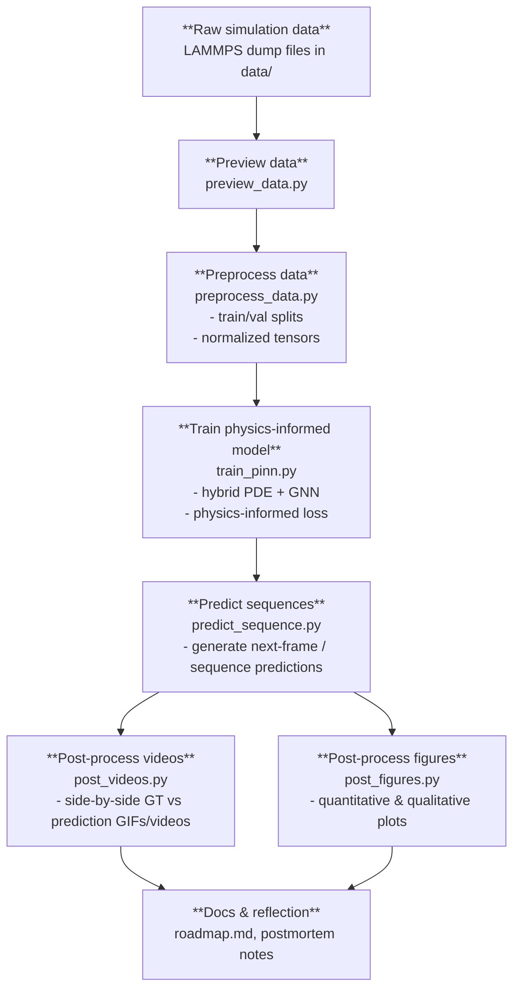

# Physics-Informed Frame Prediction (Project 2)

This project continues from **Project 1: Frame Prediction with LAMMPS Data**, but focuses on building a **physics-informed** model for next-frame / sequence prediction.

The core goals are to design a **hybrid PDE + GNN** model and incorporate **physics constraints** directly into the loss function.

---

## Repository Structure

```text
ML_project2/
├── data/
├── src/
│   ├── preview_data.py
│   ├── preprocess_data.py
│   ├── train_pinn.py
│   ├── predict_sequence.py
│   ├── post_videos.py
│   ├── post_figures.py
├── roadmap.md
├── requirements.txt
├── .gitignore
└── ML_project2.code-workspace
```

---

## High-Level Workflow

Below is the intended end-to-end flow for this project.



Further sections (setup, usage examples, and a refined discussion of physics-informed losses) will be added as the implementation matures.
