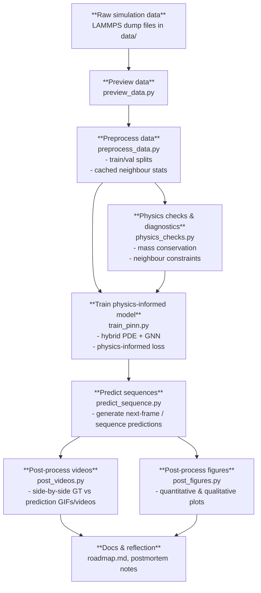

# Physics-Informed Frame Prediction (Project 2)

This project continues from **Project 1: Frame Prediction with LAMMPS Data**, but focuses on building a **physics-informed** model for next-frame / sequence prediction.

The core goals are to design a **hybrid PDE + GNN** model and incorporate **physics constraints** directly into the loss function.

---

## Repository Structure

```text
ML_project2/
├── data/
├── src/
│   ├── preview_data.py
│   ├── preprocess_data.py
│   ├── physics_checks.py
│   ├── train_pinn.py
│   ├── predict_sequence.py
│   ├── post_videos.py
│   ├── post_figures.py
├── physics.md
├── roadmap.md
├── requirements.txt
└── .gitignore
```

---

## High-Level Workflow

Below is the intended end-to-end flow for this project.



---

## Demo

This project focuses on comparing **ground truth LAMMPS frames** with predictions from a **physics-informed hybrid PDE + GNN model**.

```text
[GIF placeholder]
Ground truth vs physics-informed prediction over a sequence of frames.
```

In the final version, this section will embed a GIF (e.g. `output/prediction_vs_gt_pinn.gif`) showing:
- Left: ground truth simulation.
- Right: model prediction.

---

## Quantitative Comparison

```text
[Figure placeholder]
Quantitative comparison of ground truth vs prediction.
```

This section will show one or more figures (e.g. `output/quantitative_comparison_pinn.png`) that summarize:
- Error metrics between ground truth and predictions.
- One or two representative profiles (e.g. centreline cuts) comparing shapes and interfaces.

---

## Conclusion

This section will briefly summarize the key observations from the physics-informed model, for example:
- How well the model respects the intended physical constraints.
- Where it improves on a naive GNN baseline.
- Remaining limitations or failure modes.

---

## How to Reproduce

Once the implementation is complete, the results shown above can be reproduced with a sequence of commands similar to:

```bash
python src/preview_data.py
python src/preprocess_data.py
python src/train_pinn.py
python src/predict_sequence.py
python src/post_videos.py
python src/post_figures.py
```

---

## License

This project is for educational purposes.
